<h2>TensorFlow-FlexUNet-Image-Segmentation-EDD2020-Endoscopy (2025/08/17)</h2>

This is the first experiment of Image Segmentation for Endoscopy Disease Detection and Segmentation (EDD2020) Multiclass based on our 
<a href="https://github.com/sarah-antillia/TensorFlow-FlexUNet-Image-Segmentation-Model">
TensorFlowFlexUNet (TensorFlow Flexible UNet Image Segmentation Model for Multiclass) 
</a> and a 512x512 pixels 
<a href="https://drive.google.com/file/d/1_0wlTQCdpVNeJjF8ZOJGKEsyIEwZhakt/view?usp=sharing">
Augmented-EDD2020-PNG-ImageMask-Dataset.zip</a> with colorized masks
(BE:green, suspiciousi:blue, HGD:cyan, cancer:red, polyp:yellow)
which was derived by us from  
<a href="https://www.kaggle.com/datasets/orvile/edd2020-endoscopy-detection-and-segmentation">
<b>EDD2020: Endoscopy Detection and Segmentation</b> 
</a>
 
 
<b>Acutual Image Segmentation for 512x512 EDD2020 images</b> 
As shown below, the inferred masks predicted by our segmentation model trained on the PNG 
dataset appear similar to the ground truth masks. 
<b>rgb_map = (BE:green, suspiciousi:blue, HGD:cyan, cancer:red, polyp:yellow)</b>
 
<table>
<tr>
<th>Input: image</th>
<th>Mask (ground_truth)</th>
<th>Prediction: inferred_mask</th>
</tr>
<tr>
<td>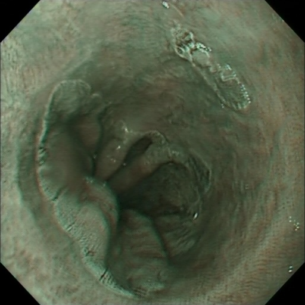</td>
<td>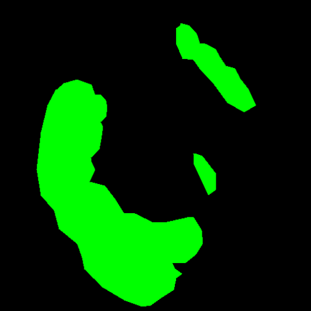</td>
<td>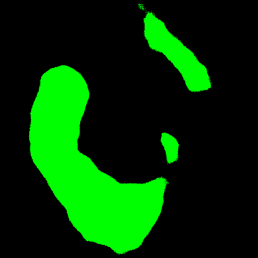</td>
</tr>
<tr>
<td>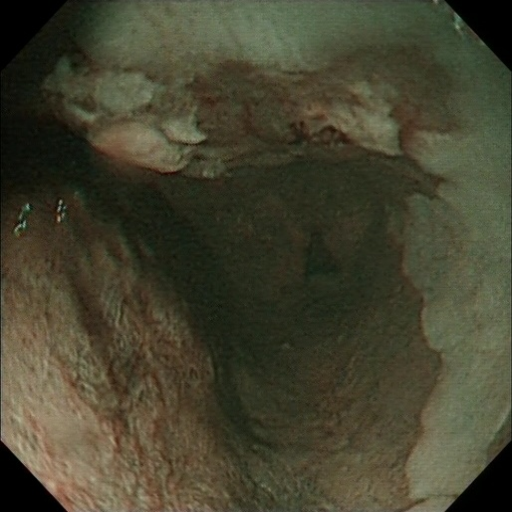</td>
<td>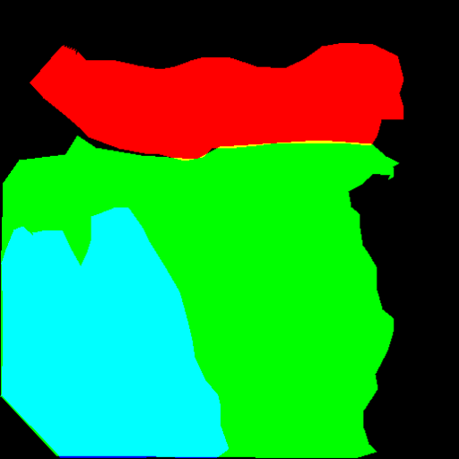</td>
<td>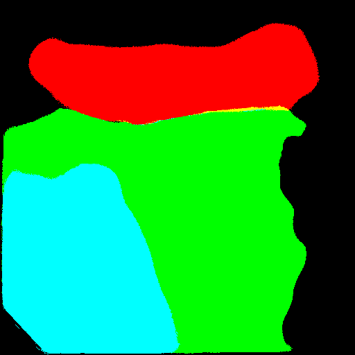</td>
</tr>
<tr>
<td>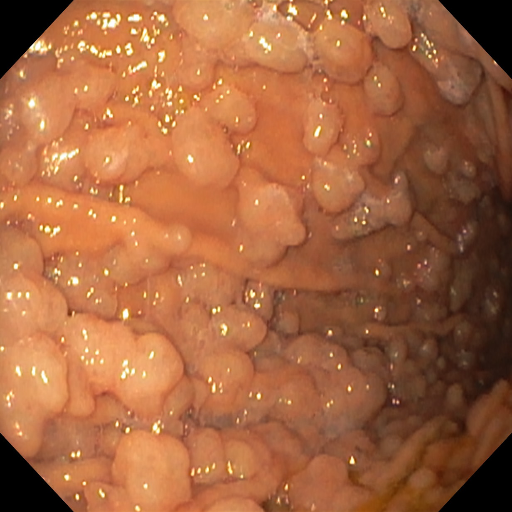</td>
<td>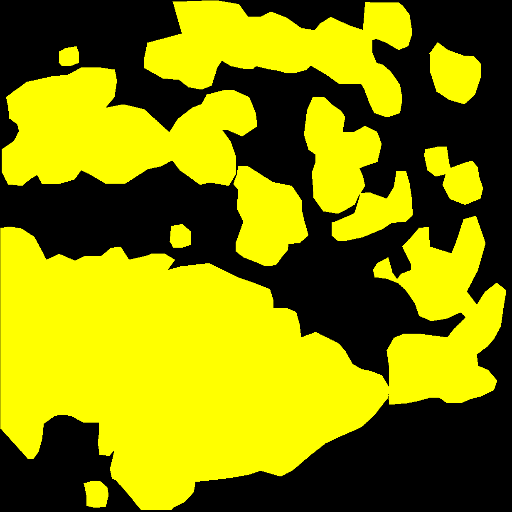</td>
<td>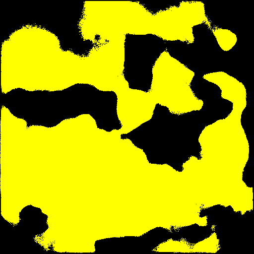</td>
</tr>
</table>

 
<h3>1. Dataset Citatioin</h3>
The orginal dataset use here has been taken from
<a href="https://www.kaggle.com/datasets/orvile/edd2020-endoscopy-detection-and-segmentation">
<b>EDD2020: Endoscopy Detection and Segmentation</b> 
</a>
  
<b>About Dataset</b> 
EDD2020: Endoscopy Disease Detection & Segmentation 
Multi-Organ Disease Analysis Dataset 
 
Step into EDD2020, a multi-center dataset with 386 annotated endoscopy images from the colon, esophagus, and stomach. 
Featuring 5 disease classes, it’s designed for detection and segmentation tasks to push AI in clinical endoscopy forward! 
 
 
<b>What’s This About?</b> 
EDD2020 tackles disease detection and segmentation in endoscopy videos from 5 global centers. 
With bounding boxes and pixel-level masks for conditions like polyps, cancer, and Barrett’s,
 it’s a benchmark for real-time monitoring and offline analysis—boosting precision in GI healthcare.
 
 
<b>What’s Inside?</b> 
Images: 386 (all labeled) 
Classes: 5 (BE, suspicious, HGD, cancer, polyp) 
Source: Multi-organ (colon, esophagus, stomach) from 5 centers 
 
<b>Citation</b> 
Using EDD2020? Cite it: 
Ali, Sharib; Braden, Barbara; Lamarque, Dominique; Realdon, Stefano; Bailey, Adam; Cannizzaro,  
Renato; Ghatwary, Noha; Rittscher, Jens; Daul, Christian; East, James.  
(2020). Endoscopy Disease Detection and Segmentation (EDD2020) [Dataset].  
IEEE DataPort. https://dx.doi.org/10.21227/f8xg-wb80 

 
<b>License:</b> 
<a href="https://creativecommons.org/licenses/by/4.0/">
Creative Commons Attribution 4.0 (CC BY 4.0).
</a>
  
<h3>
<a id="2">
2 EDD2020 ImageMask Dataset
</a>
</h3>
 If you would like to train this EDD2020 Segmentation model by yourself,
 please download the dataset from the google drive  
<a href="https://drive.google.com/file/d/1_0wlTQCdpVNeJjF8ZOJGKEsyIEwZhakt/view?usp=sharing">
Augmented-EDD2020-PNG-ImageMask-Dataset.zip</a>.
 
, expand the downloaded ImageMaskDataset and put it under <b>./dataset</b> folder to be
<pre>
(BE:green,  suspiciousi:blue,  HGD: cyan,   cancer:red,  polyp:yellow)
./dataset
└─EDD2020
    ├─test
    │  ├─images
    │  └─masks
    ├─train
    │  ├─images
    │  └─masks
    └─valid
        ├─images
        └─masks
</pre>
 
<!--
On the derivation of the augmented dataset with colorized masks, please refer to the following Python scripts: 
<li><a href="./generator/ImageMaskDatasetGenerator.py">ImageMaskDatasetGenerator.py</a></li>
<li><a href="./generator/split_master.py">split_master.py</a></li>
 
-->
 
<b>EDD2020 Statistics</b> 
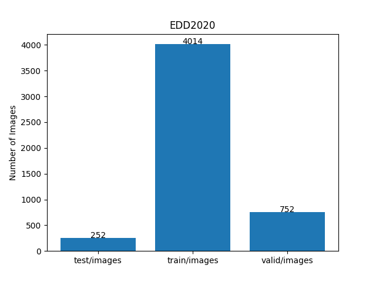 
 
As shown above, the number of images of train and valid datasets is large enough  
to use for a training set of our segmentation model.
 
 

<b>Train_images_sample</b> 
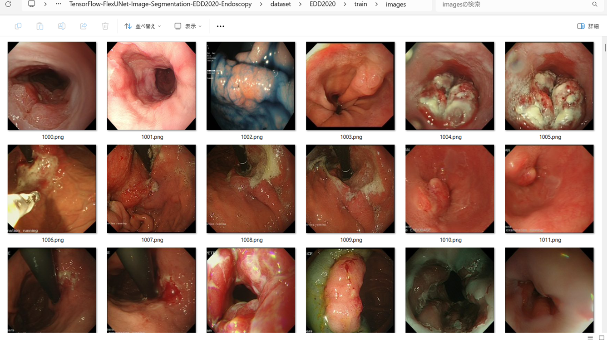
 
<b>Train_masks_sample</b> 
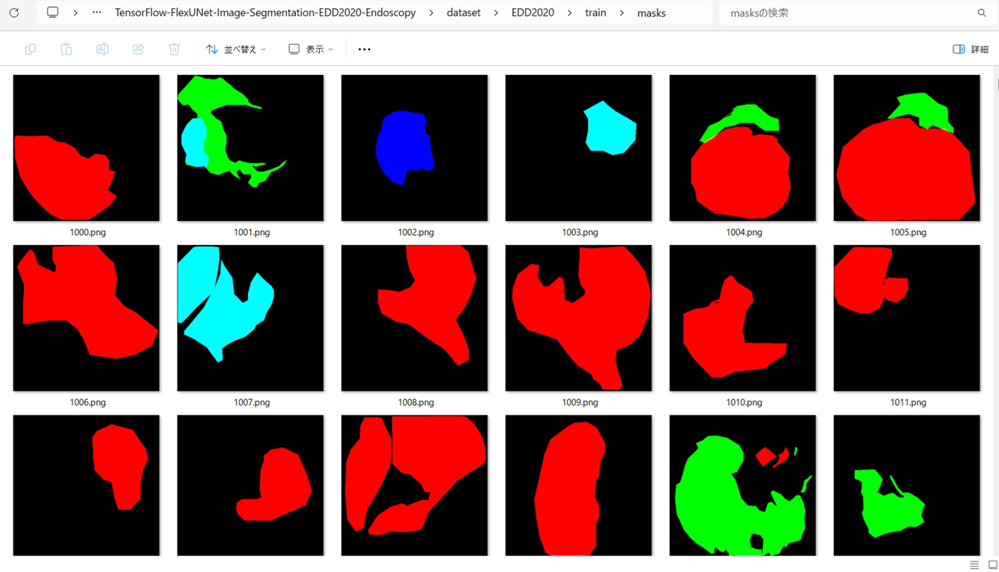
 
 
 

<h3>
3 Train TensorFlowFlexUNet Model
</h3>
 We trained EDD2020 TensorFlowFlexUNet Model by using the following
<a href="./projects/TensorFlowFlexUNet/EDD2020/train_eval_infer.config"> <b>train_eval_infer.config</b></a> file.  
Please move to ./projects/TensorFlowFlexUNet/EDD2020 and run the following bat file. 
<pre>
>1.train.bat
</pre>
, which simply runs the following command. 
<pre>
>python ../../../src/TensorFlowFlexUNetTrainer.py ./train_eval_infer.config
</pre>

<b>Model parameters</b> 
Defined a small <b>base_filters = 16 </b> and large <b>base_kernels = (9,9)</b> for the first Conv Layer of Encoder Block of 
<a href="./src/TensorFlowFlexUNet.py">TensorFlowFlexUNet.py</a> 
and a large num_layers (including a bridge between Encoder and Decoder Blocks).
<pre>
[model]
;You may specify your own UNet class derived from our TensorFlowFlexModel
model         = "TensorFlowFlexUNet"
generator     =  False
image_width    = 512
image_height   = 512
image_channels = 3
num_classes    = 6

base_filters   = 16
base_kernels   = (9,9)
num_layers     = 8
dropout_rate   = 0.05
dilation       = (1,1)
</pre>
<b>Learning rate</b> 
Defined a very small learning rate.  
<pre>
[model]
learning_rate  = 0.00007
</pre>
<b>Loss and metrics functions</b> 
Specified "categorical_crossentropy" and <a href="./src/dice_coef_multiclass.py">"dice_coef_multiclass"</a>. 
<pre>
[model]
loss           = "categorical_crossentropy"
metrics        = ["dice_coef_multiclass"]
</pre>
<b>Dataset class</b> 
Specifed <a href="./src/ImageCategorizedMaskDataset.py">ImageCategorizedMaskDataset</a> class. 
<pre>
[dataset]
class_name    = "ImageCategorizedMaskDataset"
</pre>
 
<b>Learning rate reducer callback</b> 
Enabled learing_rate_reducer callback, and a small reducer_patience.
<pre> 
[train]
learning_rate_reducer = True
reducer_factor     = 0.5
reducer_patience   = 4
</pre>
<b>Early stopping callback</b> 
Enabled early stopping callback with patience parameter.
<pre>
[train]
patience      = 10
</pre>

<b>RGB Color map</b> 
rgb color map dict for EDD2020 1+5 classes. 
<pre>
[mask]
mask_file_format = ".png"
; 1+5 classes
; RGB colors          BE:green,  suspiciousi:blue,  HGD: cyan,   cancer:red,  polyp:yellow
rgb_map = {(0,0,0):0, (0,255,0):1, (0,0,255):2,   (0,255,255):3, (255,0,0):4, (255,255,0):5}
</pre>

<b>Epoch change inference callback</b> 
Enabled <a href="./src/EpochChangeInfereuncer.py">epoch_change_infer callback</a></b>. 
<pre>
[train]
epoch_change_infer       = True
epoch_change_infer_dir   =  "./epoch_change_infer"
num_infer_images         = 6
</pre>

By using this callback, on every epoch_change, the inference procedure can be called
 for 6 images in <b>mini_test</b> folder. This will help you confirm how the predicted mask changes 
 at each epoch during your training process.    

<b>Epoch_change_inference output at starting (epoch 1,2,3)</b> 
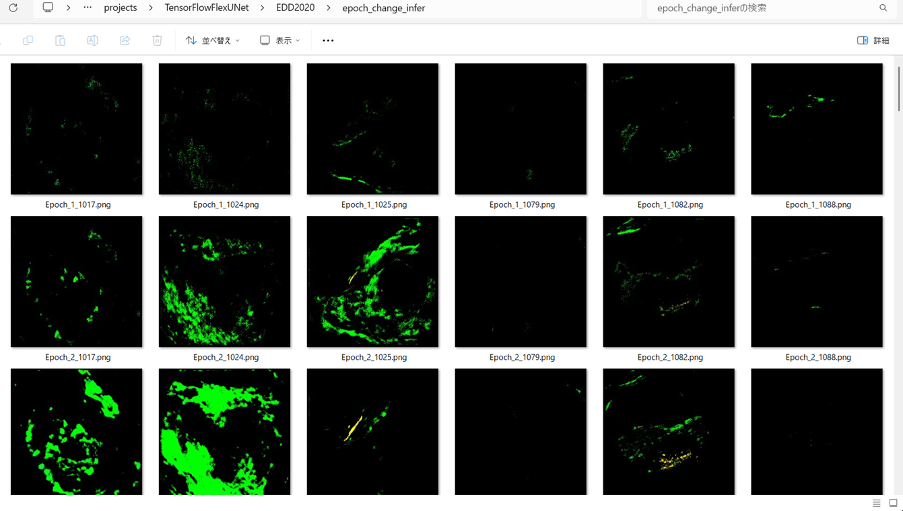 
 
<b>Epoch_change_inference output at middlepoint (epoch 16,17,18)</b> 
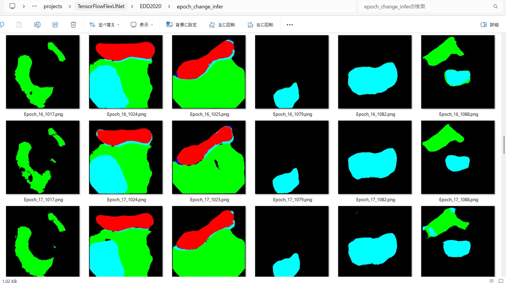 
 
<b>Epoch_change_inference output at ending (epoch 34,35,36)</b> 
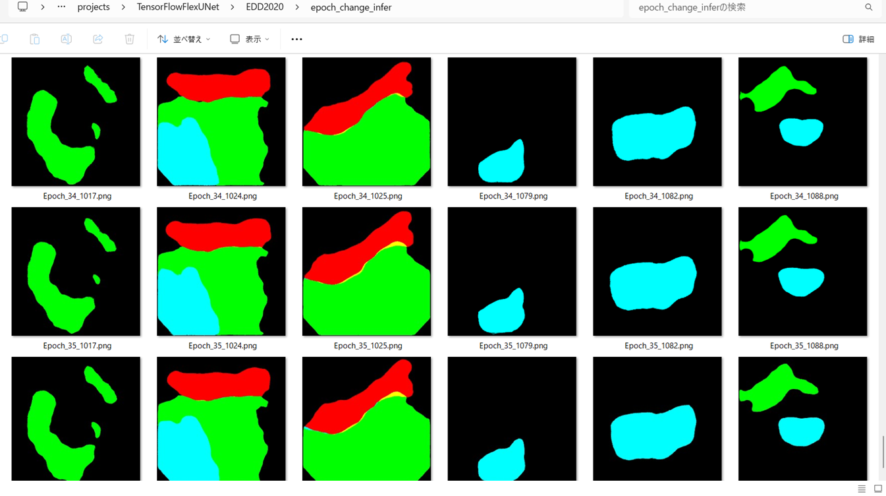 
 
In this experiment, the training process was stopped at epoch 36 by EarlyStopping callback.  
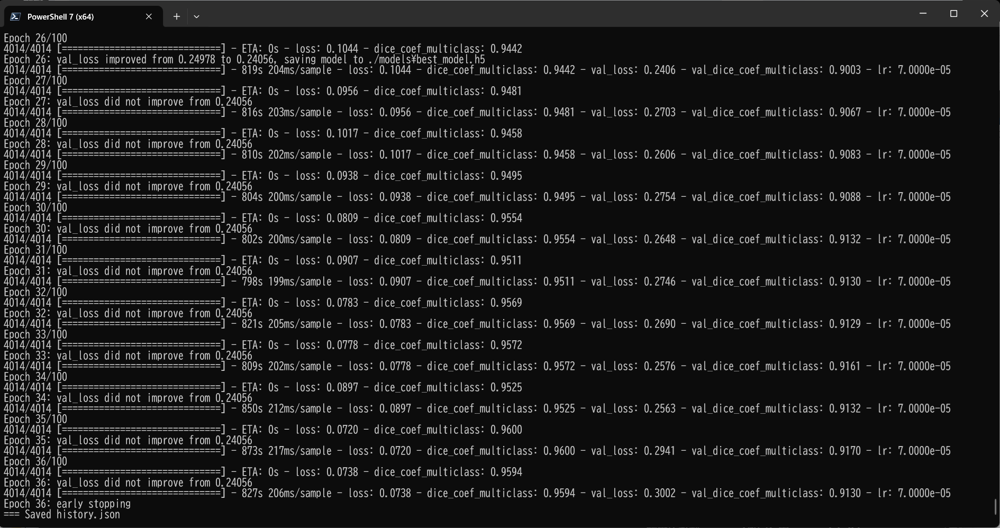 
 

<a href="./projects/TensorFlowFlexUNet/EDD2020/eval/train_metrics.csv">train_metrics.csv</a> 
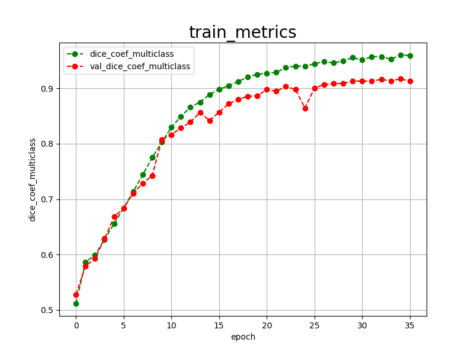 

 
<a href="./projects/TensorFlowFlexUNet/EDD2020/eval/train_losses.csv">train_losses.csv</a> 
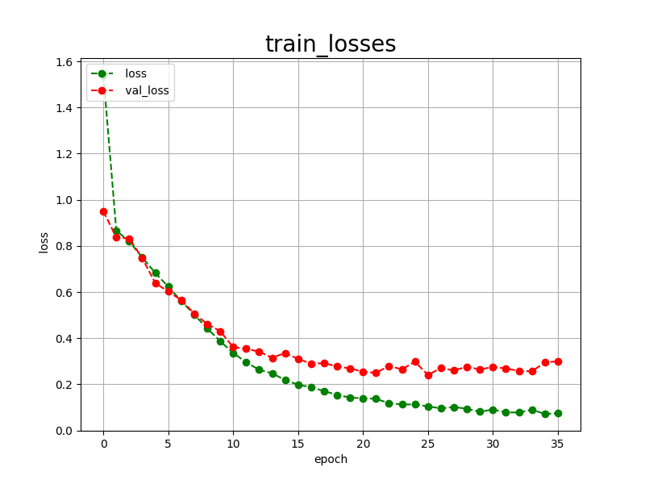 

 

<h3>
4 Evaluation
</h3>
Please move to <b>./projects/TensorFlowFlexUNet/EDD2020</b> folder, 
and run the following bat file to evaluate TensorFlowFlexUNet model for EDD2020. 
<pre>
./2.evaluate.bat
</pre>
This bat file simply runs the following command.
<pre>
python ../../../src/TensorFlowFlexUNetEvaluator.py ./train_eval_infer_aug.config
</pre>

Evaluation console output: 
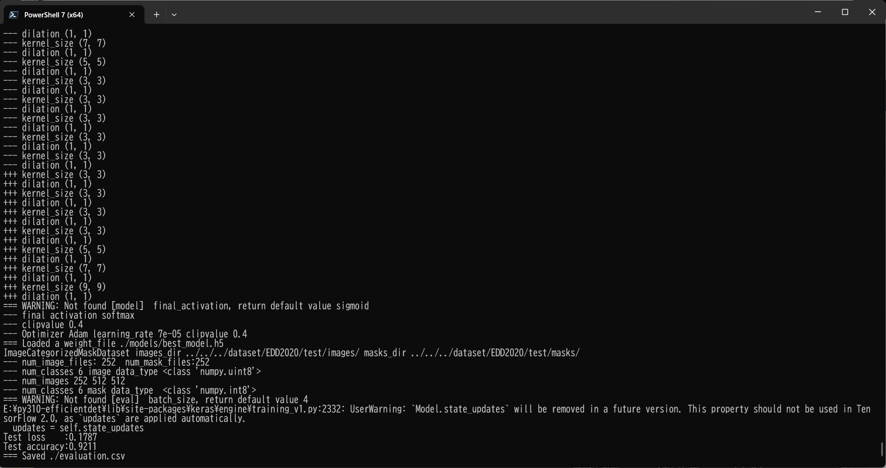
  

<a href="./projects/TensorFlowFlexUNet/EDD2020/evaluation.csv">evaluation.csv</a> 
The loss (categorical_crossentropy) to this EDD2020/test was not low and dice_coef_multiclass 
 high as shown below.
 
<pre>
categorical_crossentropy,0.1787
dice_coef_multiclass,0.9211
</pre>
 

<h3>
5 Inference
</h3>
Please move <b>./projects/TensorFlowFlexUNet/EDD2020</b> folder 
,and run the following bat file to infer segmentation regions for images by the Trained-TensorFlowFlexUNet model for EDD2020. 
<pre>
./3.infer.bat
</pre>
This simply runs the following command.
<pre>
python ../../../src/TensorFlowFlexUNetInferencer.py ./train_eval_infer_aug.config
</pre>

<b>mini_test_images</b> 
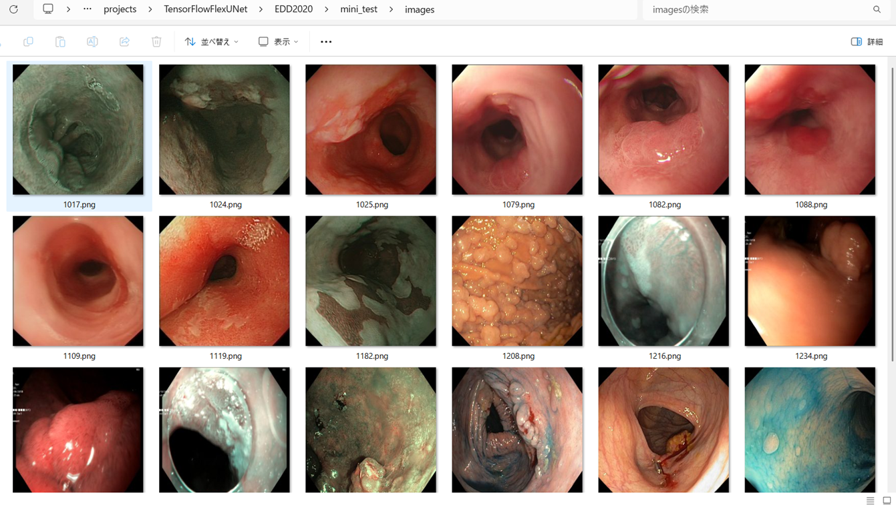 
<b>mini_test_mask(ground_truth)</b> 
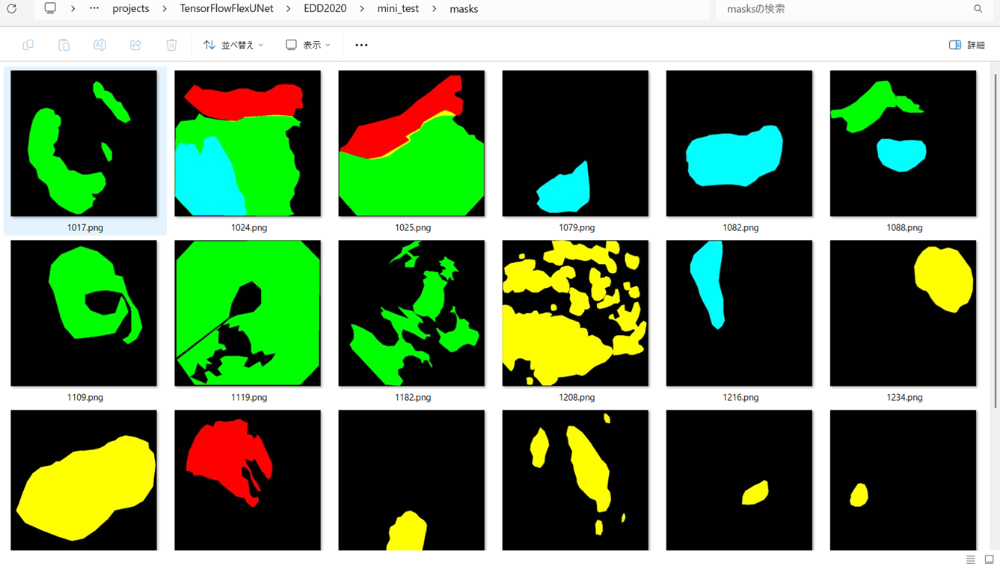 

<b>Inferred test masks</b> 
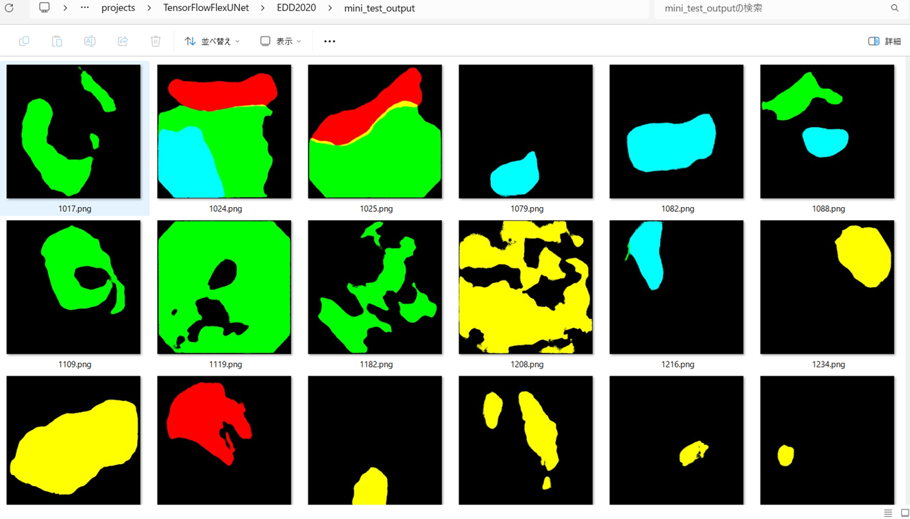 
 

<b>Enlarged images and masks of 512x512 pixels</b> 
<b>rgb_map = (BE:green, suspiciousi:blue, HGD:cyan, cancer:red, polyp:yellow)</b>
<table>
<tr>
<th>Image</th>
<th>Mask (ground_truth)</th>
<th>Inferred-mask</th>
</tr>

<tr>
<td>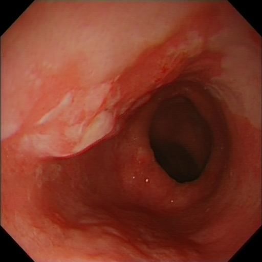</td>
<td>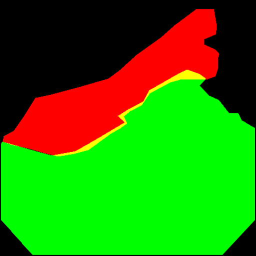</td>
<td>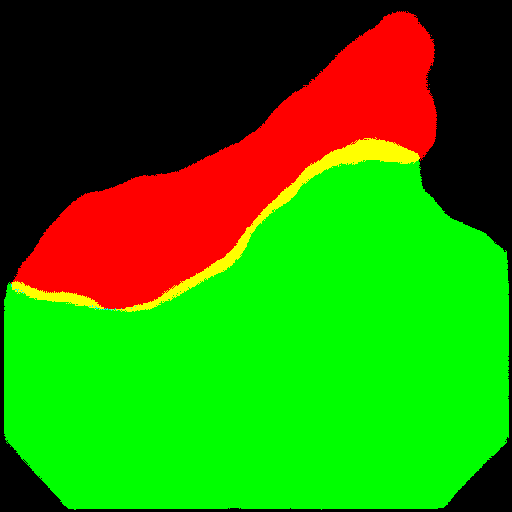</td>
</tr>

<tr>
<td>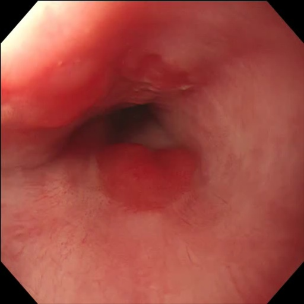</td>
<td>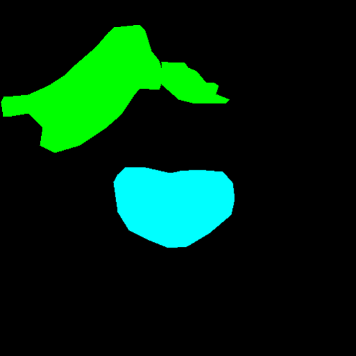</td>
<td></td>
</tr>

<tr>
<td>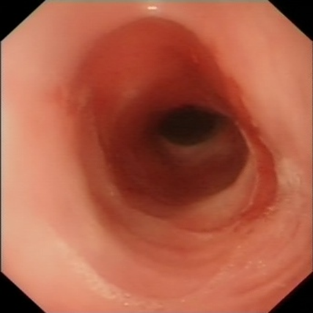</td>
<td>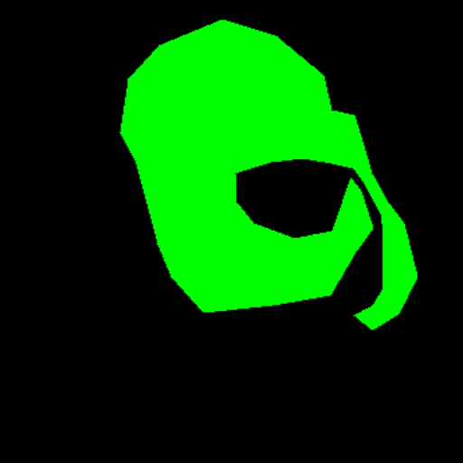</td>
<td>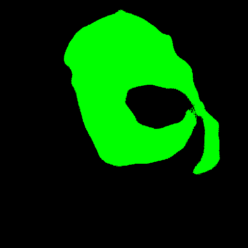</td>
</tr>

<tr>
<td>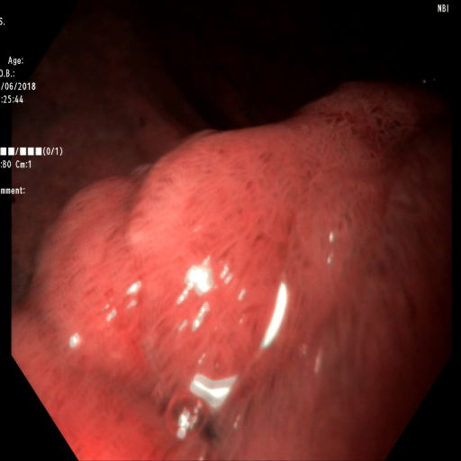</td>
<td></td>
<td>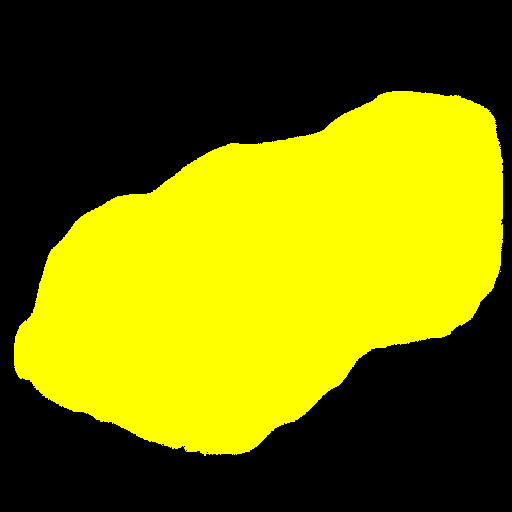</td>
</tr>

<tr>
<td>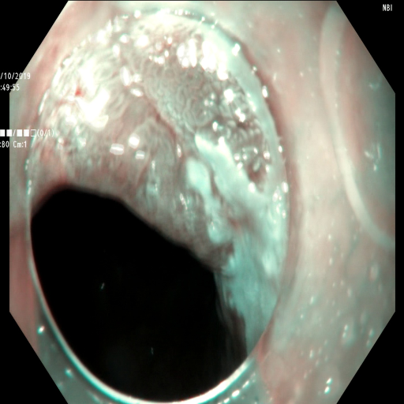</td>
<td>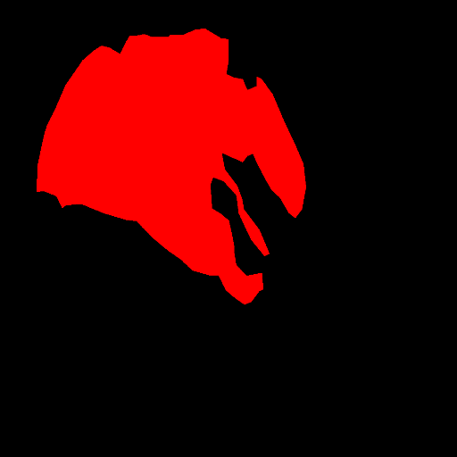</td>
<td>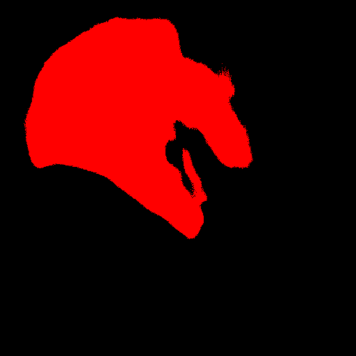</td>
</tr>

<tr>
<td>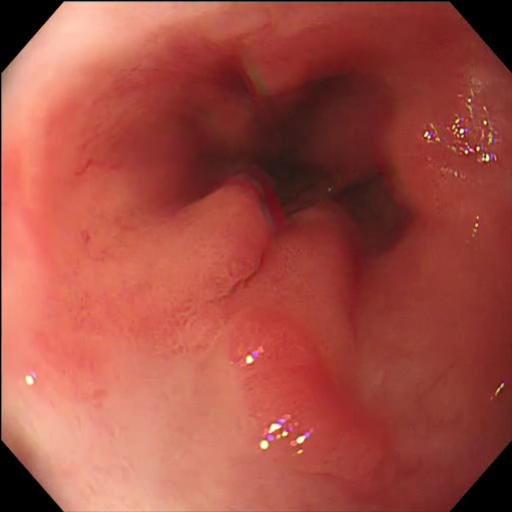</td>
<td>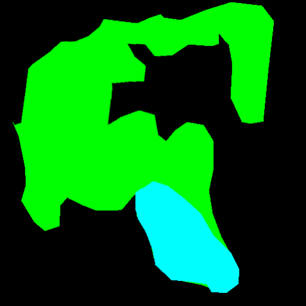</td>
<td>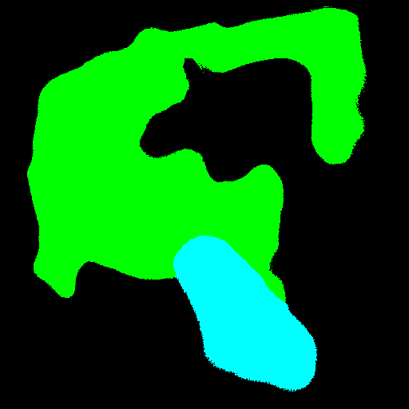</td>
</tr>
</table>

 
<h3>
References
</h3>
<b>1. EDD2020: Endoscopy Detection and Segmentation</b> 
<a href="https://www.kaggle.com/datasets/orvile/edd2020-endoscopy-detection-and-segmentation">
https://www.kaggle.com/datasets/orvile/edd2020-endoscopy-detection-and-segmentation
</a>

 
 
<b>2. Endoscopy Disease Detection and Segmentation (EDD2020)</b> 
<a href="https://ieee-dataport.org/competitions/endoscopy-disease-detection-and-segmentation-edd2020">
https://ieee-dataport.org/competitions/endoscopy-disease-detection-and-segmentation-edd2020
</a>
 
 
<b>3. DETECTION AND SEGMENTATION OF ENDOSCOPIC ARTEFACTS AND DISEASES USING DEEP ARCHITECTURES</b> 
Nhan T. Nguyen, Dat Q. Tran, Dung B. Nguyen 
doi: https://doi.org/10.1101/2020.04.17.20070201 
<a href="https://www.medrxiv.org/content/10.1101/2020.04.17.20070201v1.full-text">
https://www.medrxiv.org/content/10.1101/2020.04.17.20070201v1.full-text
</a>
 
 
<b>4. TRANSFERLEARNINGFORENDOSCOPYDISEASEDETECTIONANDSEGMENTATION 
 WITHMASK-RCNNBENCHMARKARCHITECTURE</b> 
 Shahadate Rezvy, Tahmina Zebin, Barbara Braden, Wei Pang, Stephen Taylor, Xiaohong W Gao 
<a href="https://ueaeprints.uea.ac.uk/id/eprint/74726/1/EDD2020.pdf">
https://ueaeprints.uea.ac.uk/id/eprint/74726/1/EDD2020.pdf</a>
 
 

